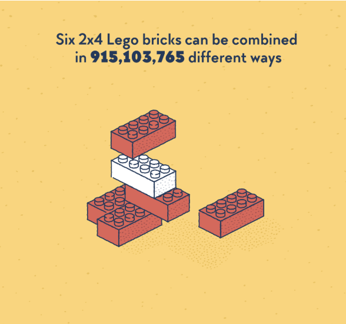

# HDFS 2025 R Workshop - Figures

## Brief review

### 1. what we will cover in this part?

-   Basic plot
-   ggplot

### 2. what's the difference between this two parts?

-   Basic plot - Help give you a brief review of how your data looks like - Help give you a brief review of what's the relationship between variables

-   ggplot - More advanced tools for making pretty figures

## Let's start

### 3. Basic plot

-   `plot()` - simple scatter plot +1 `plot(y) : scatter plot of`y`against an index variable   +2`plot(x, y)`: scatter plot of`x`(horizontal axis) against`y`; +3`plot(factor, y)`: box-and-whisker plot of`y\` at each factor level

```{r}
# Define a vector with 5 values
x <- c(1, 4, 6, 5, 9)
y <- c(1, 2, 3, 4, 5)

# Plot the ice cream vector with default settings
plot(x)
plot(y)
plot(x, y)
plot(factor(x), y)
```

-   `barplot()` - bar plot with vertical or horizontal bars
-   `hist()` - histogram of cells defined by breaks
-   `boxplot()` - box-and-whisker plot of the given (grouped) values.

```{r setup, include=FALSE}
barplot(x)
hist(x)
boxplot(x)

# lets try the real-world data
df <- cars
View(df)
boxplot(df$speed)
boxplot(df$dist)
plot(df$speed ~ df$dist)
```

### 4. ggplot

We need the ggplot2 package first

```{r}
require(ggplot2)
require(tidyverse)
```

Imagine ggplot as lego!

{width="50%"}

```{r}
## we are going to use a dataset contains data for 344 penguins.
require(palmerpenguins)
?palmerpenguins
?palmerpenguins::penguins
skimr::skim(penguins)
head(penguins)
glimpse(penguins)
View(penguins)
penguins <- palmerpenguins::penguins
```

#### The 1st block: Mapping & setting aesthetics

```{r}
#ggplot(dataset, aes(x, y)) + geom_family
ggplot(data = penguins, aes(x = sex)) +
         geom_bar()

ggplot(data = penguins, aes(x = sex, y = body_mass_g)) +
         geom_boxplot()

penguins <- penguins %>% 
  filter(!is.na(sex) & !is.na(body_mass_g))

#we can make adjustment on the figures elements
ggplot(data = penguins, aes(x = sex, y = body_mass_g)) +
         geom_boxplot(width = 0.6, outlier.shape = NA)
#width: adjust box plot aesthetics to make it more narrow; outlier.shape = NA: remove outliers
```

#### The 2nd block: let's add some color

```{r}
# "fill = xxx" versus "color = xxx"
ggplot(data = penguins, aes(x = sex, y = body_mass_g, color = sex)) +
         geom_boxplot()
        #scale_color_manual(values = c("blue","lightblue"))

ggplot(data = penguins, aes(x = sex, y = body_mass_g, fill = sex)) +
         geom_boxplot()
        #scale_fill_manual(values = c("blue","lightblue"))

ggplot(data = penguins, aes(x = flipper_length_mm, y = body_mass_g, color = sex)) +
  geom_point()
  #scale_color_manual("Sex",values = c("purple","pink"))

```

#### The 3rd block: let's add some labels

```{r}
ggplot(data = penguins, aes(x = flipper_length_mm, y = body_mass_g, color = sex)) +
  geom_point() +
  labs(x = "Flipper Length (mm)", 
       y = "Body Mass (grams)", 
       title = "Figure 1. Flipper Length and body mass in different sex",
       caption = "Source: palmerpenguins")
```

#### The 4th block: we want more facets/dimensions

facet_grid(. \~ Sex, scales = "free_x", space = "free_x")

-   \~ Sex: This specifies the formula for faceting. In this case, it means to create separate panels for each level of the "Support_Type" variable.

-   The dot (.) on the left side of the tilde (\~) indicates that the x-axis should be free, allowing different scales for each panel.

-   scales = "free_x": This argument ensures that each panel (subplot) on the x-axis has its own scale. Without this, all panels would share the same x-axis scale.

-   space = "free_x": This argument allows the panels to have different widths on the x-axis. \# The default is to make all panels have the same width, but setting space = "free_x" allows for flexibility.

```{r}
ggplot(data = penguins, aes(x = flipper_length_mm, y = body_mass_g, color = sex)) +
  geom_point() +
  labs(x = "Flipper Length (mm)", 
       y = "Body Mass (grams)", 
       title = "Figure 1. Flipper Length and body mass in different sex",
       caption = "Source: palmerpenguins") +
  facet_grid(.~ species, scales = "free_x", space = "free_x") #(.~ species * island)

```

### The 5th block: we want change the style of the figure (font/sizes/background)

```{r}
# you can use some canned themes! check them out yourself
ggplot(data = penguins, aes(x = flipper_length_mm, y = body_mass_g, color = sex)) +
  geom_point() + #alpha = 0.3
  labs(x = "Flipper Length (mm)", 
       y = "Body Mass (grams)", 
       title = "Figure 1. Flipper Length and body mass in different sex",
       caption = "Source: palmerpenguins") +
  facet_grid(.~ species, scales = "free_x", space = "free_x") +
  theme_light() #theme_dark()

# if you want to change the theme manually
ggplot(data = penguins, aes(x = flipper_length_mm, y = body_mass_g, color = sex)) +
  geom_point() + #alpha = 0.3
  labs(x = "Flipper Length (mm)", 
       y = "Body Mass (grams)", 
       title = "Figure 1. Flipper Length and body mass in different sex",
       caption = "Source: palmerpenguins") +
  facet_grid(.~ species, scales = "free_x", space = "free_x") +
  theme(legend.position = "none",
        axis.title.x = element_text(size = 9, face = "bold"),
        axis.title.y = element_text(size = 9, face = "bold"),
        legend.text = element_text(size = 5),
        plot.title = element_text(hjust = 0.5)
        )
        #legend.position = "none"

```

### The 6th block: add lines

```{r}
# We add a regression line
ggplot(data = penguins, aes(x = flipper_length_mm, y = body_mass_g)) +
  geom_point() +
  labs(x = "Flipper Length (mm)", 
       y = "Body Mass (grams)") +
  geom_smooth(method = "lm", linetype = 1, color = "black",size = 0.3)

ggplot(data = penguins, aes(x = flipper_length_mm, y = body_mass_g, color = sex)) +
  geom_point() + #alpha = 0.3
  geom_smooth(method = "lm", linetype = 1, color = "black", size = 0.3) +
  labs(x = "Flipper Length (mm)", 
       y = "Body Mass (grams)", 
       title = "Figure 1. Flipper Length and body mass in different sex",
       caption = "Source: palmerpenguins") +
  facet_grid(.~ species, scales = "free_x", space = "free_x") +
  theme(legend.position = "none",
        axis.title.x = element_text(size = 9, face = "bold"),
        axis.title.y = element_text(size = 9, face = "bold"),
        legend.text = element_text(size = 5),
        plot.title = element_text(hjust = 0.5)
        )
```

### Other blocks: use the cheat sheet & Chatgpt!

<https://ggplot2.tidyverse.org/>

### Save plots

```{r}
#make the plot an object
pengeuin_plot <- ggplot(data = penguins, aes(x = flipper_length_mm, y = body_mass_g, color = sex)) +
  geom_point() + #alpha = 0.3
  geom_smooth(method = "lm", linetype = 1, color = "black", size = 0.3) +
  labs(x = "Flipper Length (mm)", 
       y = "Body Mass (grams)", 
       title = "Figure 1. Flipper Length and body mass in different sex",
       caption = "Source: palmerpenguins") +
  facet_grid(.~ species, scales = "free_x", space = "free_x") +
  theme(legend.position = "none",
        axis.title.x = element_text(size = 9, face = "bold"),
        axis.title.y = element_text(size = 9, face = "bold"),
        legend.text = element_text(size = 5),
        plot.title = element_text(hjust = 0.5)
        )

# save the plot to a file (e.g., in PNG format)
ggsave("Pengeuin_Plot.png", plot = pengeuin_plot, width = 5, height = 6, units = "in")
```

### More advanced techniques:

-   Plot simple slope-covered in part 4
