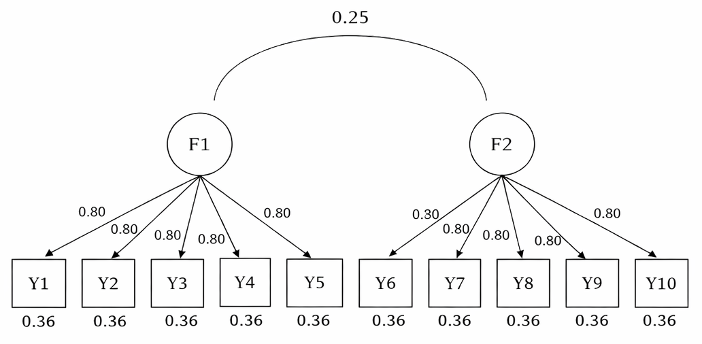
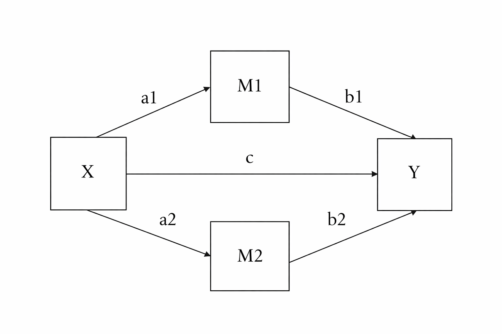

```{r setup, include=FALSE}
install.packages("simsem")
#install.packages("snow")
library(simsem)
library(lavaan)
```

# Model 1: two factor CFA

```{r}
##step1, specify the population model

twoFactorPop <- "
f1 =~ 0.8 * y1 + .8 * y2 + .8 * y3 + .8 * y4 + .8 * y5
f2 =~ 0.8 * y6 + .8 * y7 + .8 * y8 + .8 * y9 + .8 * y10
#how strongly each indicator relates to a 1 SD change in the latent variable

f1 ~~ 1 * f1 ##variance = 1: standardize
f2 ~~ 1 * f2
f1 ~~ .25 * f2

y1  ~~ .36 * y1 #1-0.8*0.8 = 0.36
y2  ~~ .36 * y2
y3  ~~ .36 * y3
y4  ~~ .36 * y4
y5  ~~ .36 * y5
y6  ~~ .36 * y6
y7  ~~ .36 * y7
y8  ~~ .36 * y8
y9  ~~ .36 * y9
y10 ~~ .36 * y10
"

##step2, specify the model we want to test
twoFactorModel <- "
f1 =~ y1 + y2 + y3 + y4 + y5
f2 =~ y6 + y7 + y8 + y9 + y10
f1 ~~ 1 * f1
f2 ~~ 1 * f2
f1 ~~ f2
"

## step3&4, Reapeat sampling & run the model
twoFactorOut <- sim(
  100,
  model = twoFactorModel,
  n = 60,
  generate = twoFactorPop,
  lavaanfun = "lavaan",
  seed = 20260130,
  auto.var = TRUE,
  auto.fix.first = FALSE
)
```

## Get summary statistics
### columns correspond to:
### 1. Estimate.Average: Average of parameter estimates
### 2. Estimate.SD: Standard deviation of parameter estimates (the empirical standard errors)
### 3. Average.SE: Average of standard errors of each parameter estimate
### 4. Power: The proportion of significant parameter estimates
### 5. Std.Est: Average of standardized parameter estimates
### 6. Std.SD: Standard deviation of standardized parameter estimates (the empirical standard errors)
### 7. Average.Param: Population parameter values underlying simulated data
### 8. Average.Bias: Average relative bias of parameter estimates
###    (relative bias = (population parameter - average parameter estimate) /
###     population parameter)
### 9. Coverage: Proportion replication with confidence intervals containing
###    the population parameter values.
```{r}
summaryParam(twoFactorOut, detail = TRUE, alpha = .05)
```

## Muthen & muthen (2002) specify 3 criteria:
### 1. parameter and standard error bias for ALL parameters < .10 
### 2. standard error bias for focal parameters is < .05 (e.g., a coefficient that corresponds to a hypothesis)
### 3. coverage between .91 and .98
### parameter bias = (average estimate across simulations - population value)/population value. It is in the column "rel bias"
### standard error bias = (average se across simulations - population value)/population value. It is in the column "rel se bias"
### coverage = proportion of simulations for which 95% CI contains population value
### Based on output, we see not all three criterions are met. We only did 100 simulations and varied the sample size; Let's try out a larger sample size  


# Model 2: Two mediator SEM


```{r}
twomsem_pop_model <- '
# direct effect
Y ~ 0.2 * X

# mediator
M1 ~ 0.30 * X
Y  ~ 0.20 * M1

M2 ~ 0.30 * X
Y  ~ 0.30 * M2

Y  ~~ 0.60 * Y #After X, M1, and M2, 60% of Y’s variance is unexplained (random noise)
M1 ~~ 0.30 * M1 #M1 still has 30% unexplained variance after X
M2 ~~ 0.40 * M2
'

twomsem_model <- '
# Paths to Y
Y ~ c*X + b1*M1 + b2*M2

# Paths to Mediators
M1 ~ a1*X
M2 ~ a2*X

# indirect effects (a*b)
first_Med := a1 * b1
second_Med := a2 * b2
total   := c + first_Med + second_Med
'

# if you want standadized version
# twomsem_pop_model_std <- '
# # --------------------
# # Standardized variances
# # --------------------
# X  ~~ 1*X
# M1 ~~ 1*M1
# M2 ~~ 1*M2
# Y  ~~ 1*Y
# 
# # --------------------
# # Structural paths (standardized)
# # --------------------
# Y  ~ 0.20*X + 0.20*M1 + 0.30*M2
# # A one–standard-deviation increase in X is associated with a 0.20-unit increase in Y
# M1 ~ 0.30*X
# M2 ~ 0.30*X
# 
# # --------------------
# # Residual variances (derived)
# # --------------------
# M1 ~~ 0.91*M1 1−0.3*0.3=0.91
# M2 ~~ 0.91*M2 
# Y  ~~ 0.7592*Y 1−0.2408=0.7592
# '

twomsemOut <- sim(
  500,
  model = twomsem_model,
  n = 300,
  generate = twomsem_pop_model,
  lavaanfun = "lavaan",
  seed = 20260130,
  auto.var = TRUE,
  auto.fix.first = FALSE
)
```

```{r}
summaryParam(twomsemOut, detail = TRUE, alpha = .05)
## alpha = .05: significance level used when the function decides whether a parameter estimate is “significant” in each simulation replication.
```

